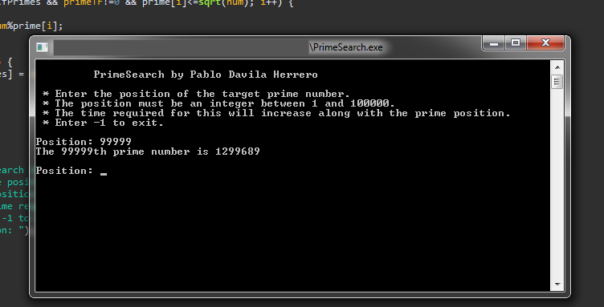

# PrimeSearch
 This tool allows you to calculate the umpteenth prime number.

 I worked on this problem during Sixth Form and I found that playing
 with primes was actually quite interesting.
 
 I may improve this tool in the future.

## Preview

